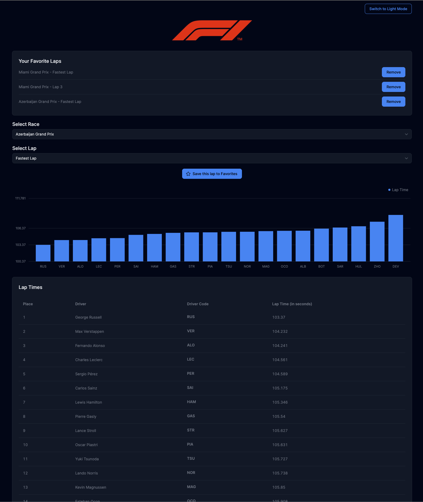

This application interfaces with the [Ergast Formula 1 API](https://ergast.com/mrd/) to retrieve the 2023 F1 schedule. Users can select individual race laps, or each driver's fastest lap for that race, for detailed lap times.

The app displays a bar chart visualizing lap times and a table sorted by the fastest laps. Additionally, users can save specific laps to Favorites for quicker access. These favorites are persistently stored in a Zustand store, leveraging localStorage for persistence across page refreshes.

The app uses Tremor for the bar chart and table as well as other components in the application. CSS styles are handled using Tailwind.



--

The app also includes support for Light and Dark mode, managed by Tailwind and localstorage.

This is a [Next.js](https://nextjs.org/) project bootstrapped with [`create-next-app`](https://github.com/vercel/next.js/tree/canary/packages/create-next-app).

## Getting Started

First, install all pacakges:

```bash
npm i
# or
yarn i
# or
pnpm i
```

Then,run the development server:

```bash
npm run dev
# or
yarn dev
# or
pnpm dev
```

Open [http://localhost:3000](http://localhost:3000) with your browser to see the result.

--

Included are 2 tests `Favorites.test.tsx` and `convertLapTimeToSeconds.test.ts`. To run these tests, simply run:

```bash
npm run test
# or
yarn test
# or
pnpm test
```
